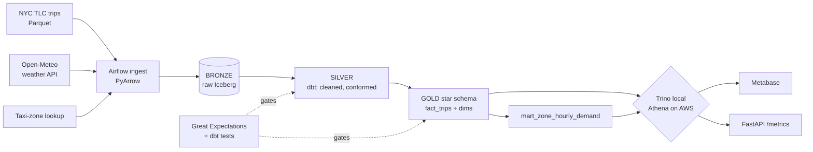

<p align="center">
  
</p>

# UrbanFlow

[](https://github.com/aakashshahani/urbanflow/actions/workflows/ci.yml)
[](LICENSE)

UrbanFlow is a batch data lakehouse for urban-mobility analytics. It ingests NYC taxi trips
and hourly weather, lands them as Apache Iceberg tables on object storage, models them with dbt
into a star schema, and serves the result through a Metabase dashboard and a FastAPI metrics
endpoint. The same Iceberg SQL runs two ways: for free on a local stack (MinIO, an Iceberg REST
catalog, and Trino), and on real AWS (S3, Glue, and Athena) for the final deploy.

The framing is a marketplace, not a pile of trip rows. The gold layer answers how demand,
revenue, and trip patterns move by zone and hour against the weather, the kind of question a
pricing or supply team actually asks, which is what makes the dimensional model and the slowly
changing zone dimension carry real weight rather than sit there for show.

## Results on the Jan 2024 sample

Every number is produced by the pipeline on real NYC TLC data, not estimated:

| Result | Measured | How |
|--------|----------|-----|
| Rows scanned for a single-day query | 2,871,948 to 74,842, **97.4% fewer** | day-partitioning `fact_trips`; `scripts/measure_scan.py` before and after |
| Duplicate trips after an incremental re-run | **0** (row count held at 2,871,948) | idempotent Iceberg `MERGE` on a deterministic `trip_key` |
| Trips ingested then modeled | 2,964,624 bronze to 2,871,948 fact | cleaned in silver, exact duplicates deduped in gold |
| Bad data reaching the gold layer | **blocked** | Great Expectations gate on the 2.96M bronze rows plus 17 dbt tests fail the DAG |

The sample is one month; the same pipeline scales to the full 100M+ row TLC history by adding
months to the ingest. The star schema serves a Metabase dashboard and a FastAPI `/metrics` endpoint.

## Architecture



A longer walkthrough of the design and the cost model is in
[docs/architecture.md](docs/architecture.md).

## Local and AWS, same Iceberg

The pipeline builds and iterates entirely on a free local stack, then stands up real AWS once
with Terraform to capture screenshots and a live Athena query, then tears it down. One switch,
`URBANFLOW_TARGET`, flips the backend.

| Layer | Local (free) | AWS (final deploy) |
|-------|--------------|--------------------|
| Object store | MinIO | S3 |
| Iceberg catalog | Iceberg REST | Glue Data Catalog |
| Query engine | Trino | Athena |
| dbt adapter | `dbt-trino` | `dbt-athena` |
| Orchestration | Airflow (docker compose) | Airflow (docker compose), never MWAA |
| Infrastructure | not needed | Terraform, `terraform destroy` when done |

The one-time AWS deploy runs on serverless, pay-per-use services with tiny data, so it costs
under two dollars. The design avoids the expensive traps on purpose: no MWAA, no Redshift, and
no VPC or NAT gateway. See the cost model in the docs.

## Quick start

```bash
cp .env.example .env
make up          # MinIO, Iceberg REST, Trino, Postgres, Airflow
make seed        # download a sample month of trips and weather into bronze
make build       # dbt build (staging to marts) on local Trino and Iceberg
make test        # pytest, dbt tests, Great Expectations
make metabase    # fetch the Trino driver, start Metabase, build the dashboard
make demo        # the whole thing end to end on the sample slice
make down        # stop the stack
```

AWS, for the final deploy only:

```bash
make tf-apply    # provision S3, Glue, Athena, IAM
make deploy-aws  # run the pipeline once against AWS
make tf-destroy  # tear it all down
```

## Project layout

```
urbanflow/
  ingestion/       Python ingestion (TLC trips, weather API) into bronze Iceberg via PyArrow
  airflow/dags/    DAGs: data-aware scheduling, SLAs, retries, dynamic task mapping, backfills
  dbt/urbanflow/   staging, marts, SCD2 snapshots, dbt tests and unit tests, contracts, docs
  quality/         Great Expectations suites that fail the pipeline
  terraform/       AWS-ready infrastructure (S3, Glue, Athena, IAM)
  api/             FastAPI /metrics over the gold marts
  scripts/         measure_scan.py bytes-scanned benchmark, helpers
  tests/           pytest on operators and ingestion
  .github/workflows/ci.yml
```

## Design decisions

- **Iceberg over Delta.** The query engine is Athena, whose native ACID table format is Iceberg,
  with first-class Glue support, so Iceberg fits the AWS stack without friction. It is also the
  higher-signal table format for these workloads: Netflix created it and Amazon, Airbnb, and
  Stripe run on it. Delta solves the same problem in the Databricks world and is a small follow-up
  if that becomes the target.
- **Athena over a managed warehouse.** For a partitioned Parquet and Iceberg workload queried
  occasionally, a serverless engine that reads files in place costs pennies and needs nothing
  running. A Redshift cluster left on would cost more in a day than this whole project.
- **Local first, on the same engine family.** Trino locally and Athena on AWS both speak the same
  Iceberg SQL, so development is free and offline, and the AWS deploy is a backend swap rather than
  a rewrite.
- **SCD Type 2 on the zone dimension.** Taxi zones are renamed and added over time, so the zone
  dimension genuinely changes, which makes Type 2 history the right model instead of a decorative
  one bolted onto a static lookup.
- **Quality gates, not quality dashboards.** Great Expectations and dbt tests run inside the DAG
  and fail it before bad data reaches gold, so freshness, volume, schema, and key integrity are
  enforced rather than merely observed.

## Data quality

Suites and tests run as pipeline steps, not as an afterthought. They cover source freshness, a
row-volume anomaly check, schema and type contracts, null and uniqueness constraints on keys, and
referential integrity from `fact_trips` to its dimensions. A failure stops the run before the gold
layer is written, so a bad load never reaches the dashboard.

## Testing

```bash
pytest -q                       # ingestion and operator unit tests
cd dbt/urbanflow && dbt test    # dbt schema tests and unit tests
python -m quality.run_checks    # Great Expectations suites
```

CI (GitHub Actions) runs ruff, sqlfluff, pytest, and a dbt build on the sample slice on every
push and pull request.

## Future work

Deferred on purpose, not missing:

- A Delta Lake variant of the gold layer for Databricks and Azure targets.
- OpenLineage events into Marquez for column-level lineage, plus a published dbt docs site.
- A streaming bridge to the trip feed to complement the batch path.

## License

[MIT](LICENSE)
